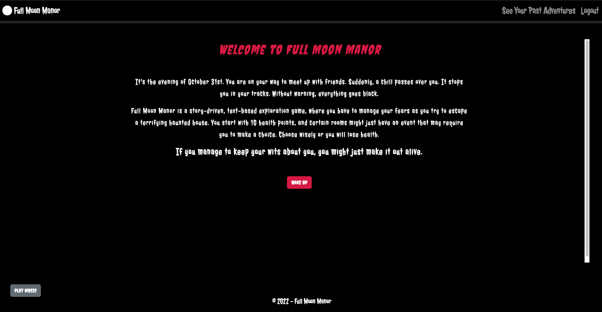
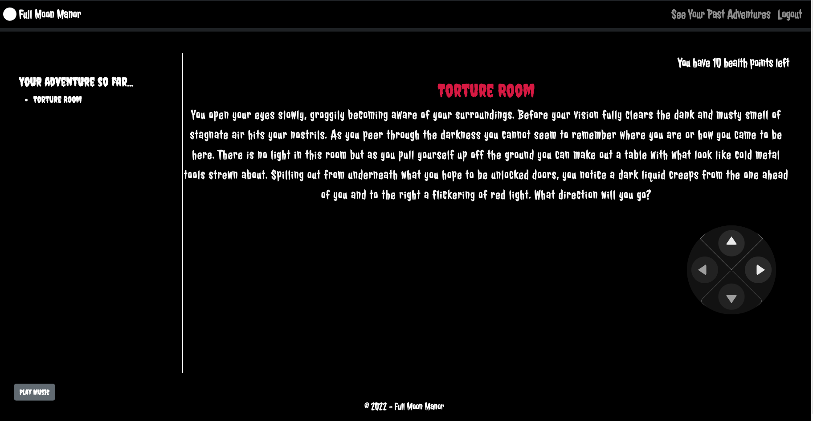
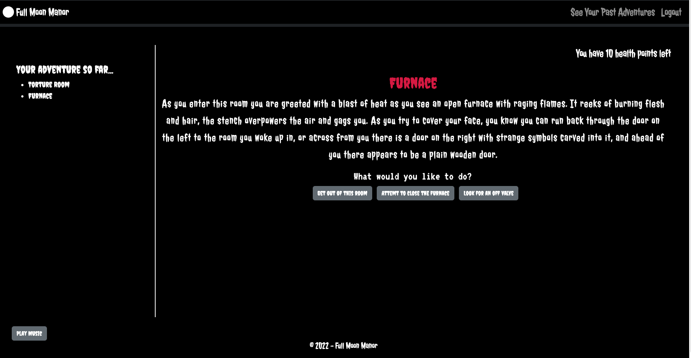
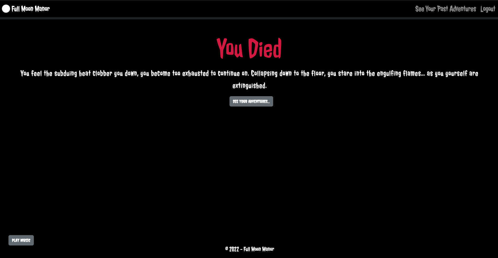

#  Full Moon Manor 

A story-driven, text-based exploration game where you have to escape a haunted house. 

## Description
<em><strong>Full Moon Manor</strong></em> is a story-driven, text-based exploration game, where a user has to manage their fears as they try to escape a terrifying haunted house. Each user creates an account, then the game can begin. They start with 10 health points, and certain rooms might just have an event that may require them to make a choice. Choose wisely or they will lose health.

Users are able to track their progress on the left side of the screen, and at the end of the game, win or lose, they are able to save their adventure to their account so they can compare how they navigated the rooms each time.

## Contributors
Created by Matthew Bronstein, Tyler Esselman, Jordan Harris, Bryce Oparah, and Joseph Ruiz.

## Technologies Used
JS React, MongoDB/Mongoose, GraphQl, React-Bootstrap, JWT-Decode, jsonWebToken, react-router-dom, react-sound, bcrypt, and apollo client and server.

## Link to live page
[Live Link](https://secret-river-41082.herokuapp.com/)

## Screenshots

